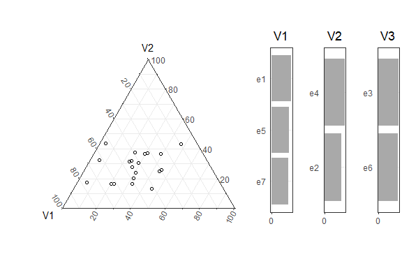
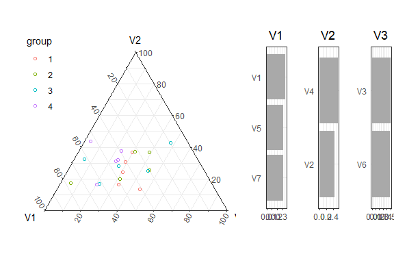
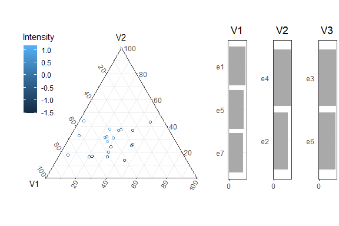
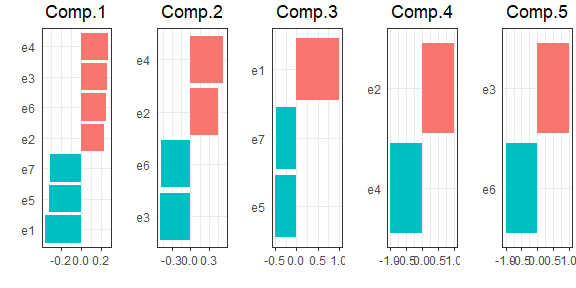

<!-- README.md is generated from README.Rmd. Please edit that file -->

# psacomp

<!-- badges: start -->
<!-- badges: end -->

*psacomp* is a package for computing *Principal Subsimplex Analysis*
introduced in *Principal Subsimplex Analysis* (2025+), Hyeon Lee, Kassel
Liam Hingee, Janice L. Scealy, Andrew T. A. Wood, Eric Grunsky, and J.
S. Marron.

## Installation

The package `psacomp` can be installed by running the following code.

``` r
library(devtools)
devtools::install_github("haneone33/psacomp")
```

## PSA Basics

First we create an example compositional data set with 7 variables and
20 data points.

``` r
set.seed(1)
X = matrix(runif(20*7),20,7)
X = sweep(X, 1, rowSums(X), '/')
```

Main function of *psacomp* is `psa()` which takes `type` and `X` as
arguments. Available options for `type` are `type = 's'` for PSA-S and
`type = 'o'` for PSA-O.

``` r
# library(psacomp)
library(devtools)
#> Loading required package: usethis
#> Warning: package 'usethis' was built under R version 4.4.1
load_all()
#> ℹ Loading psacomp
#> Registered S3 methods overwritten by 'ggtern':
#>   method           from   
#>   grid.draw.ggplot ggplot2
#>   plot.ggplot      ggplot2
#>   print.ggplot     ggplot2
#> Warning: package 'testthat' was built under R version 4.4.2
X.psas = psa(type = 's', X = X)
#> Finished creating dimension 6.
#> Finished creating dimension 5.
#> Finished creating dimension 4.
#> Finished creating dimension 3.
#> Finished creating dimension 2.
#> Finished creating dimension 1.
X.psao = psa(type = 'o', X = X)
#> Finished creating dimension 6.
#> Finished creating dimension 5.
#> Finished creating dimension 4.
#> Finished creating dimension 3.
#> Finished creating dimension 2.
#> Finished creating dimension 1.
```

## Visualization

Two types of graphics are provided. The first graphic is the ternary
plot of 2-dimensional representation. The function `plot_ternary()`
creates a ternary plot along with the plot of the three vertices.

``` r
plot_ternary(X.psas)
```



The data points can be colored according to any associated features such
as `groups` below.

``` r
groups = as.factor(rep(1:4, each = 5))
plot_ternary(X.psas, groups = groups)
```



`groups` can be continuous. The legend title is given by `group.name`.

``` r
intensity = rnorm(20)
plot_ternary(X.psas, groups = intensity, group.name = 'Intensity')
```

 The
second graphic is a bar plot representing the loading vectors.
`plot_loading(X.psas, k)` displays the first `k` loading vectors.

``` r
plot_loading(X.psas, k = 5)
```



## Output Details

`psa()` outputs a list of information calculated through PSA. The
information is summarized in the following table. Suppose `X` is a data
matrix with $n$ rows and $D$ columns.

| Name       |    Type    |  Dimension  | Description                                                                                                               |
|------------|:----------:|:-----------:|---------------------------------------------------------------------------------------------------------------------------|
| vertices   |    list    |     $D$     | `vertices$'r=i'` is an $i\times D$ matrix of vertices of representation with $i$ vertices, each row representing a vertex |
| pts.approx |    list    |     $D$     | `pts.approx$'r=i'` is an $n imes i$ matrix of rank $i-1$ representation, in the new vertex system of `vertices$'r=i'`     |
| pts        |    list    |     $D$     | `pts$'r=i'` is an $n\times D$ matrix of rank $i-1$ representation, in the original vertex system of $D$ unit vertices     |
| scores     |   matrix   | $n\times D$ | scores                                                                                                                    |
| rss        |   vector   |     $D$     | residual sum of squares                                                                                                   |
| loadings   |   matrix   | $D\times D$ | a matrix of loading vectors, each column representing a loading vector                                                    |
| modes      |    list    |     $D$     | `modes$'r=i'` is a matrix of $i$th residual, i.e. difference `pts$'r=(i+1)'-pts$'r=i'`                                    |
| const.info | data frame | $D\times 3$ | construction information. contains index of merged vertices and merge weights                                             |
